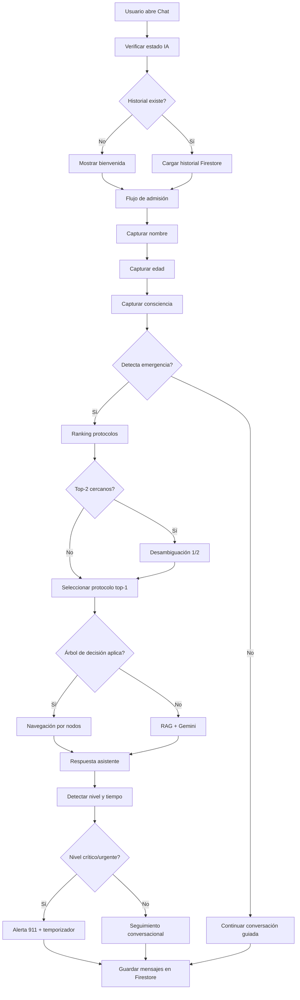
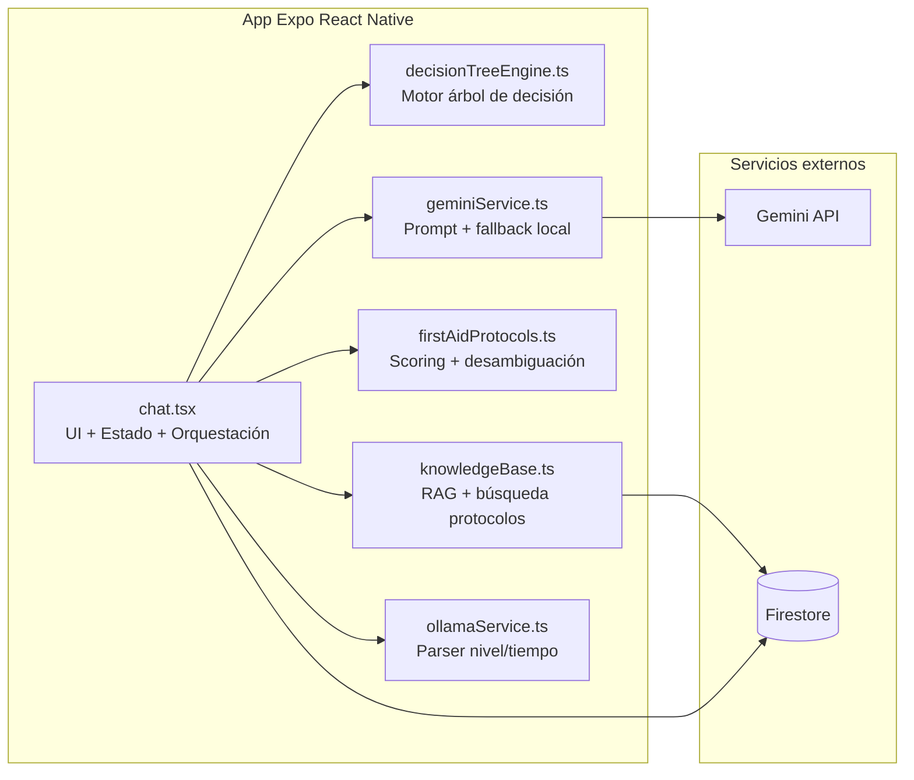
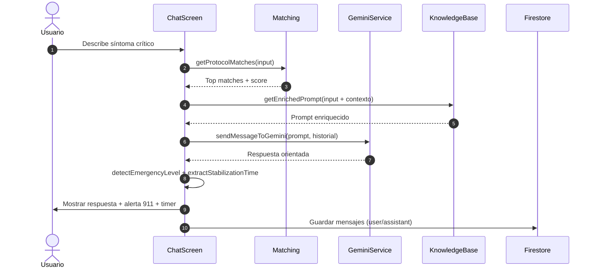
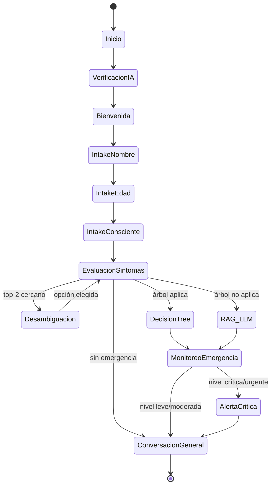
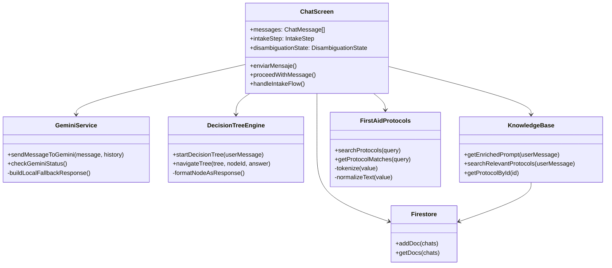
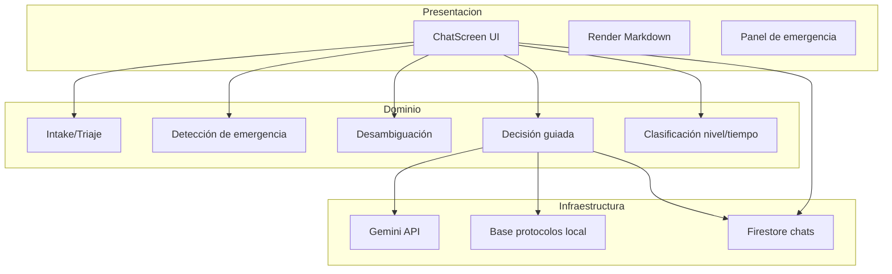

# Documento Técnico de Ingeniería de Software
## Chat de Primeros Auxilios

### Control documental

- **Proyecto:** `hola_doc`
- **Módulo:** Chat clínico conversacional
- **Versión:** 1.1
- **Estado:** Vigente
- **Fecha de emisión:** 2026-02-20
- **Audiencia:** Ingeniería de software, QA, arquitectura, producto
- **Alcance:** arquitectura, flujos, modelo de datos, decisiones de diseño, seguridad, pruebas y operación del módulo de chat.

### Historial de cambios

| Versión | Fecha       | Autor   | Cambios |
|---------|------------|---------|---------|
| 1.0     | 2026-02-20 | Equipo  | Primera edición técnica del módulo |
| 1.1     | 2026-02-20 | Equipo  | Ajustes de desambiguación, precisión clínica y seguridad de configuración |

### Índice

1. Objetivo del módulo  
2. Arquitectura lógica  
3. Flujo funcional conversacional  
4. Detección clínica y desambiguación  
5. Integración con IA  
6. Persistencia y datos  
7. Seguridad y cumplimiento  
8. Calidad, pruebas y observabilidad  
9. Rendimiento y escalabilidad  
10. Roadmap técnico recomendado  
11. Guía operativa de despliegue  
12. Conclusión ejecutiva

### Diagramas visuales (anexo)

El paquete de diagramas del módulo está en:

- `docs/diagramas/README.md`
- `docs/diagramas/01_flujo_chat.mmd`
- `docs/diagramas/02_arquitectura_chat.mmd`
- `docs/diagramas/03_secuencia_caso_critico.mmd`
- `docs/diagramas/04_estados_chat.mmd`
- `docs/diagramas/05_clases_chat.mmd`
- `docs/diagramas/06_componentes_chat.mmd`

## Anexo A) Diagramas embebidos

### A.1 Flujo funcional del chat

### A.2 Arquitectura lógica

### A.3 UML de secuencia (caso crítico)

### A.4 UML de estados

### A.5 UML de clases

### A.6 Diagrama de componentes

---

## 1) Objetivo del módulo

El módulo de chat de primeros auxilios brinda orientación conversacional en tiempo real para incidentes de salud, con foco en:

1. **Triaje inicial** (captura de contexto básico: nombre, edad, consciencia).
2. **Detección de emergencia** por síntomas/palabras clave.
3. **Desambiguación diagnóstica** cuando existen escenarios clínicos similares.
4. **Orientación guiada** mediante árbol de decisión o motor RAG + LLM.
5. **Priorización de seguridad** (alertas, recomendaciones de 911, temporizador de estabilización).
6. **Persistencia** de historial de conversación en Firestore.

---

## 2) Arquitectura lógica

### 2.1 Componentes principales

- **UI y Orquestación**
  - `app/screens/chat.tsx`
  - Responsable de estado conversacional, render de mensajes, control de flujo, timers y llamadas a servicios.

- **Motor LLM (Gemini + fallback)**
  - `services/geminiService.ts`
  - Construye prompt, inyecta contexto clínico y ejecuta `generateContent` en Gemini.
  - Fallback local determinístico cuando no hay API key o falla red/API.

- **Motor de decisión guiada (árboles)**
  - `services/decisionTreeEngine.ts`
  - Enrutamiento por nodos, validación de opciones y entrega de protocolo terminal.

- **Base de conocimiento y RAG**
  - `services/knowledgeBase.ts`
  - Búsqueda de protocolos relevantes, enriquecimiento de contexto y acceso a Firestore.

- **Catálogo clínico y matching semántico**
  - `data/firstAidProtocols.ts`
  - Reglas de scoring, normalización, ranking y selección de protocolos.

- **Persistencia**
  - Firestore colección `chats` (historial de conversación por usuario).

### 2.2 Estilo arquitectónico

Se utiliza un enfoque **modular orientado a servicios** con UI stateful en cliente React Native:

- Capa de presentación (`chat.tsx`)
- Capa de dominio (triaje/desambiguación/flujo)
- Capa de infraestructura (Gemini API / Firestore)

No existe backend propio para IA en esta versión; el cliente invoca Gemini directamente.

---

## 3) Flujo funcional conversacional

### 3.1 Flujo macro

1. Carga pantalla, verifica estado de Gemini, obtiene historial.
2. Si no hay historial: mensaje de bienvenida.
3. Flujo de admisión:
   - nombre
   - edad
   - consciencia
4. Si hay señales de emergencia:
   - matching por protocolos
   - desambiguación (si top-2 cercanos)
5. Resolución:
   - Árbol de decisión (si aplica)
   - o RAG + Gemini
6. Clasificación de severidad y temporizador.
7. Persistencia de mensajes en Firestore.

### 3.2 Máquina de estados (simplificada)

Estados de conversación:

- `INTAKE_NOMBRE`
- `INTAKE_EDAD`
- `INTAKE_CONSCIENTE`
- `INTAKE_COMPLETO`
- `DESAMBIGUACION_ACTIVA`
- `DECISION_TREE_ACTIVO`
- `RAG_LLM_ACTIVO`
- `EMERGENCIA_MONITOREO` (con timer)

Transiciones clave:

- `INTAKE_* -> RAG_LLM_ACTIVO` cuando detecta emergencia.
- `RAG_LLM_ACTIVO -> DESAMBIGUACION_ACTIVA` si score top-2 cercano.
- `DESAMBIGUACION_ACTIVA -> RAG_LLM_ACTIVO` al elegir opción 1/2.
- `* -> DECISION_TREE_ACTIVO` si se detecta árbol relevante.
- `RAG_LLM_ACTIVO -> EMERGENCIA_MONITOREO` si respuesta incluye nivel + tiempo.

---

## 4) Detección clínica y desambiguación

### 4.1 Matching de protocolos

El matching en `firstAidProtocols.ts` usa:

- Normalización de texto (lowercase + remoción de acentos).
- Tokenización con stopwords.
- Scoring ponderado por:
  - keyword exacta/frase
  - síntomas
  - título
  - condiciones relacionadas
  - cobertura de múltiples tokens del input
- Umbral mínimo de score para filtrar falsos positivos.

### 4.2 Activación de emergencia

`chat.tsx` activa rama de emergencia cuando se combinan:

- señales críticas (hints clínicos)
- confianza de categoría mínima
- o match fuerte en protocolos

### 4.3 Desambiguación (top-2)

Cuando el score del primer y segundo protocolo es cercano:

1. Se presenta pregunta de desambiguación al usuario.
2. Se muestran dos opciones con síntoma distintivo.
3. Usuario responde `1`, `2` o texto equivalente.
4. El protocolo seleccionado se fuerza como prioridad para orientar el siguiente paso.

Resultado: menor confusión entre cuadros clínicos parecidos.

---

## 5) Integración con IA

### 5.1 Estrategia híbrida

- **Primera capa (determinística):** reglas + protocolos + desambiguación.
- **Segunda capa (generativa):** Gemini para redacción guiada y adaptativa.
- **Fallback local:** respuesta segura mínima cuando Gemini no está disponible.

### 5.2 Prompt engineering

`geminiService.ts` fuerza:

- idioma español
- formato estructurado
- máximo 1-2 preguntas por turno
- orientación inmediata
- bloque “SIGUIENTE PASO”
- criterio conservador de seguridad (si duda, recomendar 911)

### 5.3 Limitaciones de la integración actual

Al usar `EXPO_PUBLIC_GEMINI_API_KEY` en frontend:

- la clave vive en entorno de cliente
- puede inspeccionarse en build

**Recomendación de ingeniería:** mover llamadas a Gemini a backend/proxy con control de rate-limits, auditoría y rotación de credenciales.

---

## 6) Persistencia y datos

### 6.1 Colecciones relevantes

- `chats`
  - `userId`
  - `role`
  - `content`
  - `timestamp`

### 6.2 Estrategia de lectura

Actualmente se filtra por `userId` y el ordenamiento se hace en cliente.

Ventaja:
- evita dependencia de índice compuesto inicial.

Costo:
- potencial sobrelectura para historiales largos.

Recomendación:
- crear índices compuestos y paginación por ventana temporal.

---

## 7) Seguridad y cumplimiento

### 7.1 Controles implementados

- Remoción de hardcode de Gemini key.
- Uso de `.env` + `.env.example`.
- `.gitignore` para archivos de entorno.
- Mensajes de seguridad clínica (recomendación 911 en casos críticos).

### 7.2 Riesgos abiertos

1. **Exposición de secretos en cliente** (riesgo medio-alto).
2. **Sin telemetría clínica trazable** para auditoría de decisiones.
3. **Sin backend de política** para moderación y throttling robusto.

### 7.3 Mitigaciones recomendadas

- Backend API para IA con token server-side.
- Rotación periódica de claves.
- Monitoreo de uso y alertas de abuso.
- Registro anonimizado de eventos clínicos y decisiones del motor.

---

## 8) Calidad, pruebas y observabilidad

### 8.1 Estrategia de pruebas sugerida

- **Unitarias**
  - extracción de nombre/edad/consciencia
  - scoring de protocolos
  - resolución de desambiguación

- **Integración**
  - chat -> RAG -> Gemini/fallback
  - chat -> decisión por árbol -> protocolo final

- **E2E**
  - flujo completo desde bienvenida hasta emergencia crítica con timer
  - escenarios ambiguos y selección 1/2

### 8.2 Casos críticos a testear

1. Entrada ambigua sin emergencia → no activar protocolo prematuro.
2. Entrada con señales críticas → alerta y guía inmediata.
3. Empate clínico top-2 → pregunta de desambiguación.
4. Falla Gemini/API key ausente → fallback funcional y seguro.
5. Persistencia de historial y restauración de contexto al recargar.

### 8.3 Observabilidad

Se recomienda instrumentar:

- latencia por respuesta
- tasa de fallback
- ratio de desambiguación activada
- nivel de emergencia detectado por sesión
- eventos de timer agotado

---

## 9) Rendimiento y escalabilidad

### 9.1 Cuellos potenciales

- Overfetch de historial sin paginación.
- Construcción de prompts largos (contexto + historial).
- Dependencia de red externa para IA.

### 9.2 Mejoras técnicas

- Paginación de historial por lotes.
- Resumen incremental de contexto de conversación.
- Cache local de protocolos frecuentes.
- Circuit breaker para API externa.

---

## 10) Roadmap técnico recomendado

### Corto plazo

1. Backend proxy para Gemini.
2. Tests unitarios para heurísticas clínicas.
3. Hardening de desambiguación en casos CRÍTICOS (bypass seguro).

### Mediano plazo

1. Índices Firestore + paginación.
2. Telemetría estructurada de decisiones.
3. Dashboard de calidad clínica conversacional.

### Largo plazo

1. Motor híbrido con calibración de confianza clínica.
2. Evaluación offline con dataset de casos sintéticos.
3. Versionado formal de protocolos y trazabilidad por release.

---

## 11) Guía operativa de despliegue

1. Configurar `EXPO_PUBLIC_GEMINI_API_KEY` en `.env` local.
2. Ejecutar app web/móvil y validar estado de conectividad.
3. Probar flujo de admisión + caso ambiguo + caso crítico.
4. Revisar logs de errores de red y fallback.
5. Verificar persistencia de mensajes en Firestore.

---

## 12) Conclusión ejecutiva

El módulo de chat de primeros auxilios ya cuenta con una base sólida de ingeniería:

- flujo conversacional de admisión,
- clasificación clínica por protocolos,
- desambiguación en diagnósticos cercanos,
- integración híbrida determinística + LLM,
- controles de seguridad funcional para escenarios críticos.

La principal deuda técnica es de **arquitectura de seguridad de secretos** y **operación observabilidad**. Resolver estos puntos elevará el sistema de un MVP robusto a una plataforma clínico-digital más escalable y auditada.
